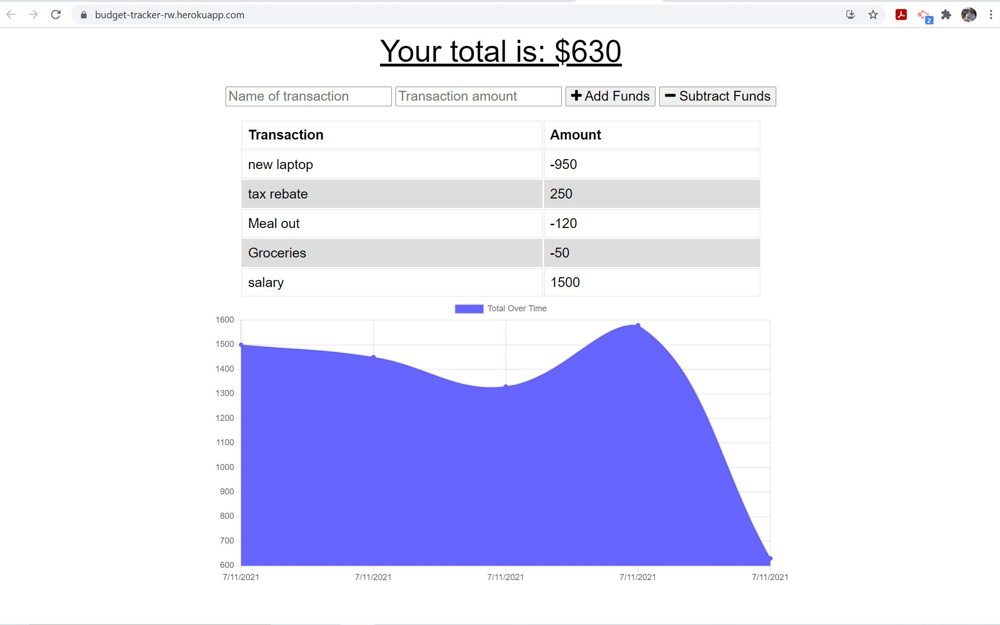
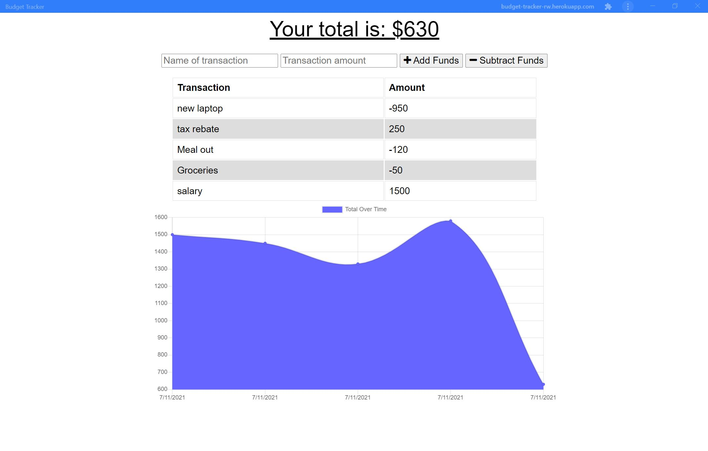

# Budget Tracker

In this assignment, I have created a budget tracking PWA. I was gives starter code for the app, including the front-end, database and server. My task was to turn the app into a PWA by including a web manifest, service worker, and indexedDB.

[Link to deployed app](https://https://budget-tracker-rw.herokuapp.com/)

## Table of Contents
* [Description](#description)
* [Installation](#installation)
* [Screenshot](#screenshot)
* [Contributions](#contributions)
* [Contact](#contact)

## Description

The app allows users to view create and track their budget. They are able to add transactions in order to keep track of income and exprenditure. The user is able to install the app to their devices and use the app offline. 

The backend functionality of the app comes from Node.js, Express, MongoDB and Mongoose, and IndexedDB.

## Installation 

* Run npm i to install all dependencies. 
* Run npm start to run the app locally.
* The user can also install the app to their devices.

## Screenshot

## Contributions

* Front end provided by Trilogy Education Services.
* Back end built by Ross White.

## Contact

* [Email](mailto:rosswhite@outlook.com)
* [LinkedIn](https://www.linkedin.com/in/ross-white-b4751814b/)
* [GitHub](https://github.com/Ross-White)

